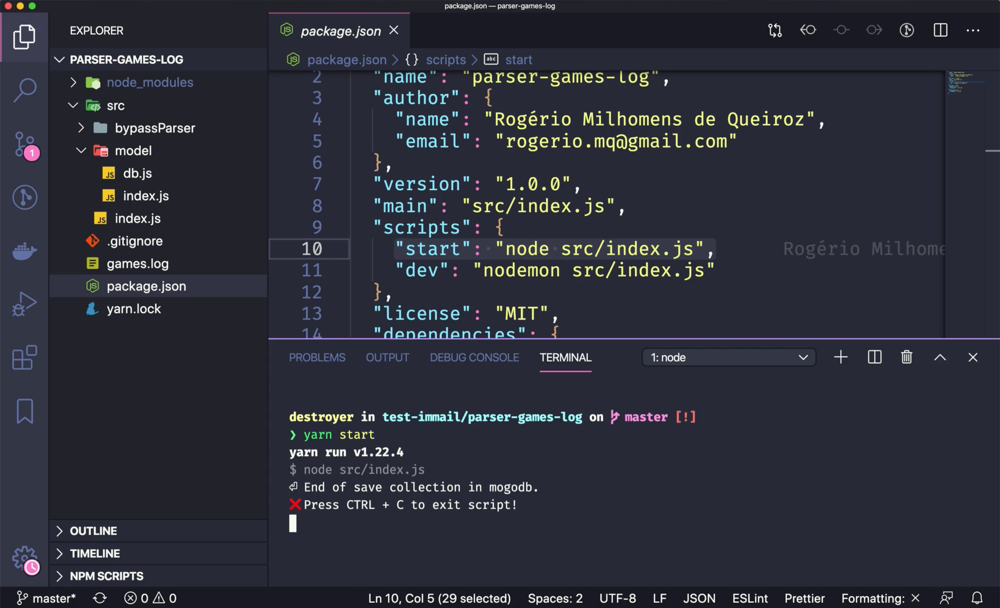

# Immail - Teste

### Neste repositório encontram-se 3 sub-projetos:

|       Projetos       | Descrição                                                    |
| :------------------: | ------------------------------------------------------------ |
| **parser-games-log** | Script responsável por ler um arquivo de log de partidas do quake-3 e exportar as informações para o banco de dados MongoDB. |
|       **api**        | Projeto responsável por fornecer uma api rest com uma rota para consumir la coleção de games do banco de dados. |
|     **frontend**     | Projeto react simples onde é possível ver os resultados de cada jogo e também um ranking geral de players por kills. |

------


#### *Banco de dados Mongodb*

Na raiz do repositório, crie uma instância do banco de dados bem como a interface de acesso com o comando:

```shell
docker-compose up -d
```

A URL de conexção pode ser diferente de acordo seu serviço de dados MongoDB;

> *Recomendo abrir cada subprojeto como um projeto principal, devido a configurações de Eslint + Prettier aplicados a cada um.*

------


## parser-games-log

- Entre no diretório **parser-games-log** e execute em seu terminal de preferência `yarn` ou  `npm install` para instalar as dependências;

- Verifique a url de conexão com banco de dados, por padrão está configurada para  o server mongodb docker em`parser-games-log/src/model/db.js` ;

- Execute o script com  `yarn start` ou `npm start`;

  -- Press CLTR + C to exit script.


[](https://youtu.be/FK47GH8n9Zk)


## api 

- Entre no diretório **api** e execute em seu terminal de preferência `yarn` ou `npm install` para instalar as dependências;
- Copie .env.example para *.env* e modifique os dados de acordo com seu ambiente;
- Execute `yarn dev` ou `npm run dev` para iniciar o webservice;
- Execute `yarn test` ou `npm run test` para rodar os testes;

[](https://youtu.be/MVjtLaT4UdI)

## frontend

- Entre no diretório **frontend** e execute em seu terminal de preferência `yarn` ou `npm install` para instalar as dependências;
- Verifique no arquivo `frontend/src/services/api.js` a url de acesso a api;
- Execute `yarn start ou `npm start` para executar o frontend em modo de desenvolvimento;
- Execute `yarn build` ou `npm run build` para criar o build da aplicação;

[](https://youtu.be/kuE0jaEAOOg)